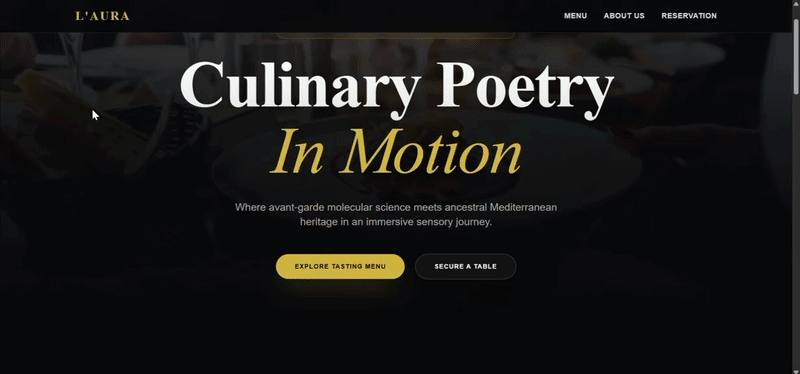
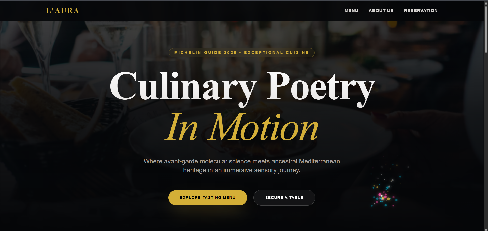
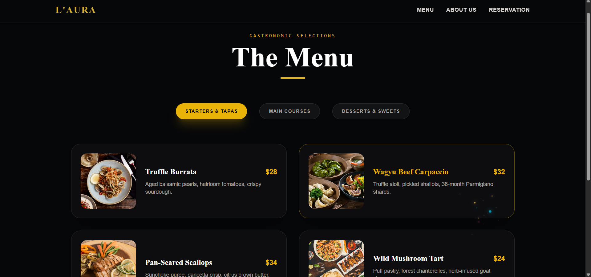
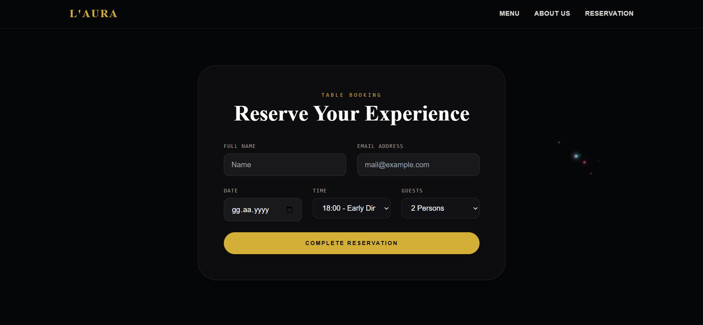
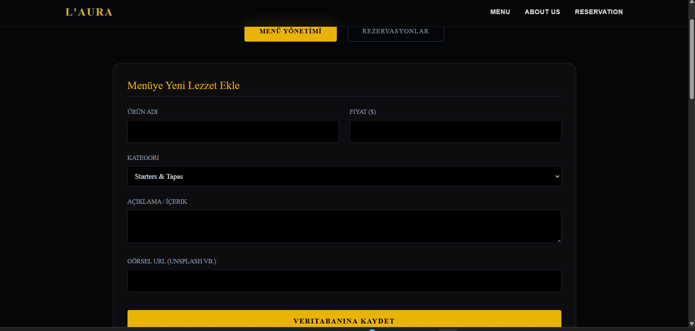

<div align="center">
  
  # 🍽️ L'AURA | Fine Dining Experience & Management System
  
  **A luxurious, highly animated full-stack web application designed for a premium fine dining restaurant.**

  <p align="center">
    
    
    
    
    
  </p>
</div>

---

## 🎥 Project Demo

> **Note to recruiter/viewer:** Watch the Framer Motion animations and full-stack database interactions in the demo below.



---

## 📸 Screenshots

<table align="center">
  <tr>
    <td align="center"><b>Home Page (Hero Section)</b></td>
    <td align="center"><b>Dynamic Menu (Database Driven)</b></td>
  </tr>
  <tr>
    <td></td>
    <td></td>
  </tr>
  <tr>
    <td align="center"><b>Reservation Booking System</b></td>
    <td align="center"><b>Secure Admin Panel (CRUD Operations)</b></td>
  </tr>
  <tr>
    <td></td>
    <td></td>
  </tr>
</table>

---

## Key Features

### For Guests (Frontend Architecture)
* **Immersive UI/UX:** A luxurious dark/gold aesthetic tailored specifically for high-end dining.
* **Framer Motion Animations:** Smooth page transitions, scroll effects, and hover states that elevate the user experience.
* **Real-Time Dynamic Menu:** Menu items are fetched directly from the SQL database and filtered by category.
* **Interactive Booking:** A seamless, responsive reservation form with instant database submission.
* **Fully Responsive:** Custom mobile drawer and optimized layouts for all screen sizes.

### For Management (Secure Admin Panel)
* **Lock Screen Authentication:** The dashboard is protected via a `/secure-login` route to prevent unauthorized access.
* **Full CRUD Operations:** Add new gourmet dishes, update prices/descriptions, and delete outdated items instantly.
* **Reservation Tracking:** View incoming booking requests, mark them as "Completed" (✓), or delete them from the system.
* **Real-time Sync:** All modifications in the admin panel immediately reflect on the customer-facing interface.

---

## Technology Stack

### Frontend (Client-Side)
* **Framework:** React.js (Vite)
* **Styling:** Tailwind CSS
* **Animations:** Framer Motion
* **Routing:** React Router DOM

### Backend (Server-Side & Database)
* **Framework:** C# .NET Core Web API
* **ORM:** Entity Framework Core
* **Database:** Microsoft SQL Server

---

## Getting Started

Follow these instructions to set up the project locally on your machine.

### Prerequisites
* [Node.js](https://nodejs.org/) (v18+)
* [.NET SDK](https://dotnet.microsoft.com/download) (v8.0+)
* Microsoft SQL Server

### 1. Start the Backend API
Navigate to the backend directory, update the database schema, and run the server:
```bash
cd LAuraApi
dotnet ef database update
dotnet run
```
The API will start listening on http://localhost:5025.

### 2. Start the Frontend (React)
Open a new terminal, navigate to the frontend folder, install dependencies, and start Vite:
```bash
cd frontend
npm install
npm run dev
```
The application will open at http://localhost:5173.

---

### 🔐 Admin Access
To test the management capabilities, navigate to:

URL: http://localhost:5173/secure-login

---

### 👨‍💻 Developer

Developed by Mustafa Ablak

LinkedIn: [https://www.linkedin.com/in/mustafa-ablak-565173299/]

Website: [https://mustafablak.vercel.app/]

✉️ Email: [mustafablak01@gmail.com]

This project was built to demonstrate proficiency in Full-Stack integration, UI/UX design principles, and RESTful API development.
